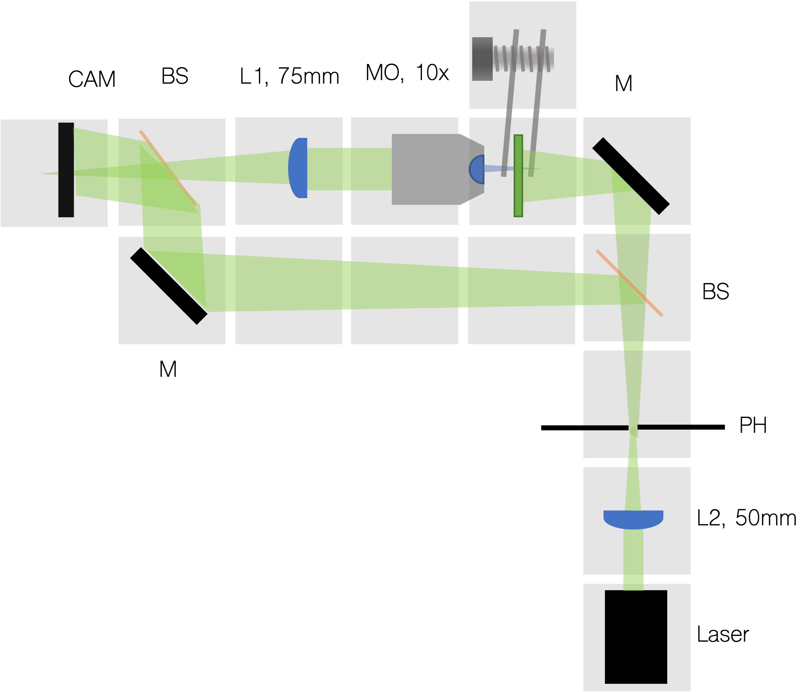
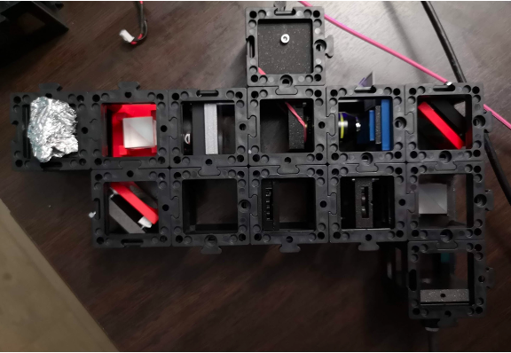
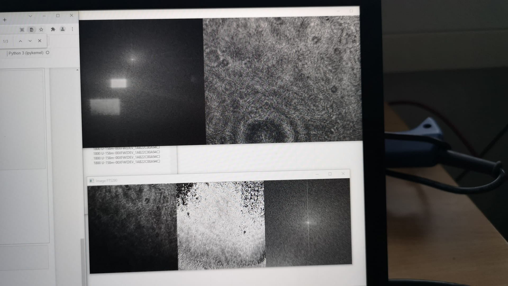
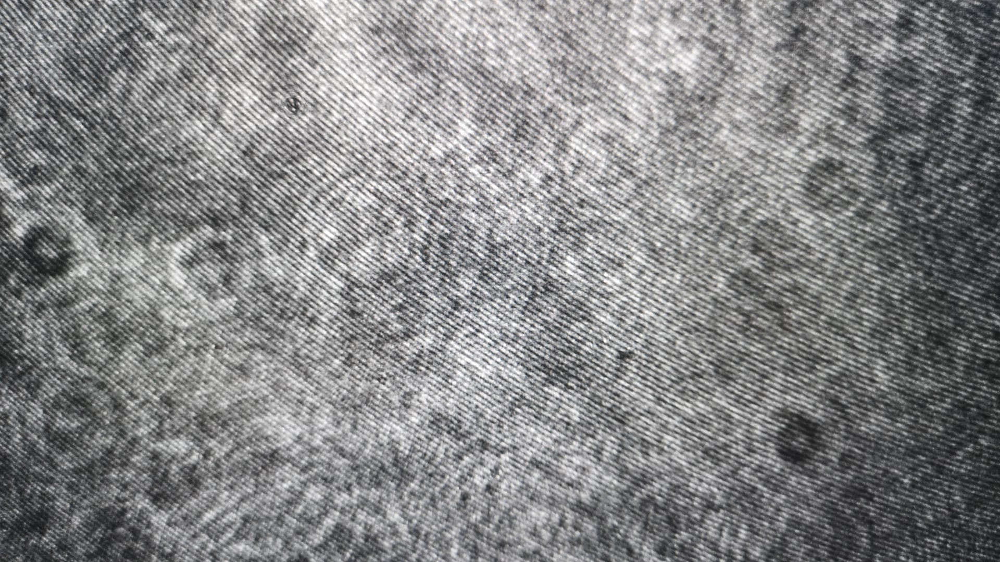

# openUC2 Holographic Microscope
---

This repository will help you to set up a very simple yet powerful off-axis holographic microscope setup that will introduce you into quantitative phase imaging in real-time. 

## The Setup

*Figure 1: Setup Off-axis Holography* 

The setup is based on an 532nm laser diode that offers relatively high temporal coherence length; enough to observe interference when splitting the beam into a reference and sample path. The following stripe-pattern on the detector can help to unmix the contribution of the ref/sample wave using a simple fwd/bwd Fourier transform and an additional selection of the region of interest in Fourier space to cut-out the cross-correlation term of the interference. For more information on holography, please also visit the [Wikipedia article](https://en.wikipedia.org/wiki/Digital_holography). A very nice review article describing the details may also be found [here](https://roderic.uv.es/bitstream/handle/10550/34482/094500.pdf;jsessionid=B0119509D01C0C39E8184B105F523BEC.nodo1?sequence=1).

*Figure 2: Photograph of Off-axis Holography Setup* 

Two beam splitter cubes first split the divergent beam, where the ref. beam travels undisturbed through the lower part of the setup visualized in *Figure 1*. The sample beam illuminates a thin object and gets scattered before an objejctive lens in combination with a tube lens (infinity corrected microscope) forms an image of the sample on the 2d detector (i.e. camera). The two wave contributions interfer after they are joined using a slightly tilted beamsplitter (2°). This is necessary to seperate the cross-correlation (U+R) out of center that represents the zeroth order (i.e. background + offset). 
To insure that the sample is illuminated evenly and that the reference wave is hitting the detector correctly, two kinematic mirrors help positioning the beam inside the cube. 

We experienced significant coherence noise that brought us to an additional spatial filtering step to limit the coherent modes of the laser. To this end, we focus the laser with a 30mm lens on a 20µm pinhole that can be precisely positioned in XY. 

***Features:***

- Temporally stable
- Low-cost
- Quantitative phase imaging
- Only plastic parts (IM cubes + 3d printed parts) necessary 
- low-number of additional optics required 
- Easy to assemble
- portable

## In-Action

We use a monochrome Allied Vision Alvium camera (158a) to capture the interference pattern and wrote a small `jupyter notebook` programm that enables manipulation of the necessary parameters (e.g. position of CC-term, phase correction) in realtime. 
You find the software in the folder [PYTHON](./PYTHON).

The output gives you:

- **Upper right:** Camera image
- **Upper left:** Fourier trnasform of camera image
- **lower right:** cropped CC-term around selected `xc/yc` coordinate
- **lower middle:** reconstructed (wrapped) phase
- **lower left:** reconstructed amplitude 

## Bill of material

Below you will find all components necessary to build this device

### 3D printing files

All these files need to be printed. We used a Prusa i3 MK3 using PLA Prusament (Galaxy Black) at layer height 0.3 mm and infill 80%.

|  Type | Details  |  Price | Link  |
|---|---|---|---|
|  | |  0.0 € | 

*comming soon*

### Additional parts

*comming soon*

### Tricks to assemble the system 

*comming soon*

#### Stripe pattern

## Get Involved

This project is open so that anyone can get involved. You don't even have to learn CAD designing or programming. Find ways you can contribute in  [CONTRIBUTING](https://github.com/openUC2/UC2-GIT/blob/master/CONTRIBUTING.md)

## License and Collaboration

This project is open-source and is released under the CERN open hardware license. Our aim is to make the kits commercially available.
We encourage everyone who is using our Toolbox to share their results and ideas, so that the Toolbox keeps improving. It should serve as a easy-to-use and easy-to-access general purpose building block solution for the area of STEAM education. All the design files are generally for free, but we would like to hear from you how is it going.

You're free to fork the project and enhance it. If you have any suggestions to improve it or add any additional functions make a pull-request or file an issue.

Please find the type of licenses [here](https://github.com/openUC2/UC2-GIT/blob/master/License.md)

REMARK: All files have been designed using Autodesk Inventor 2019 (EDUCATION)

## Collaborating
If you find this project useful, please like this repository, follow us on Twitter and cite the webpage! :-)
